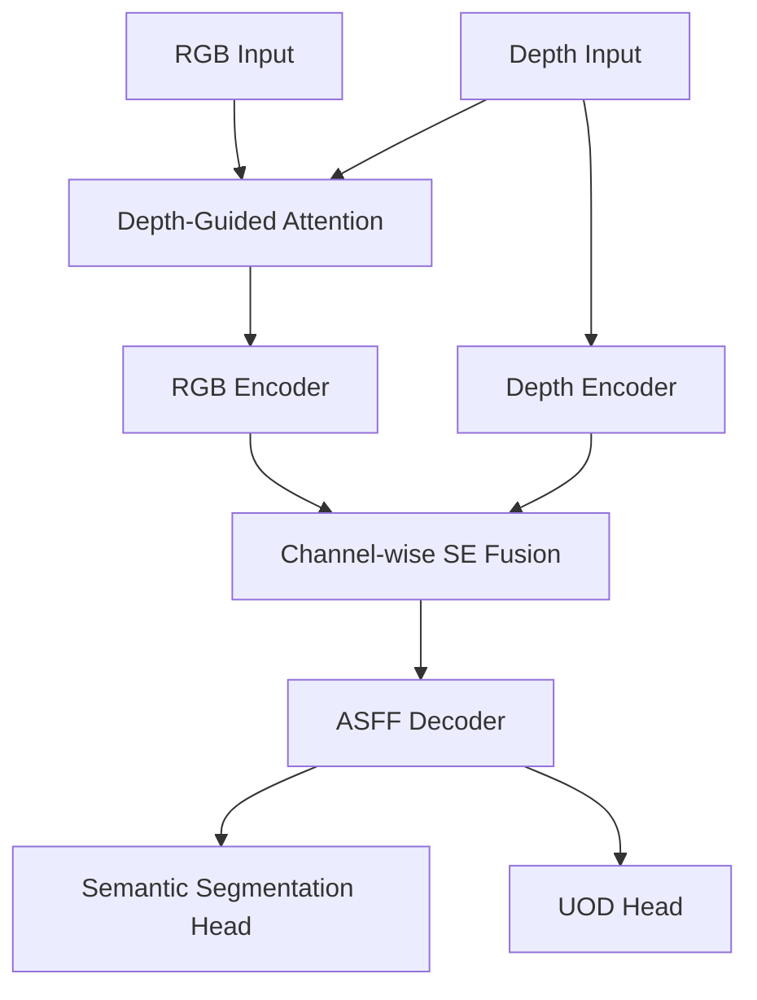
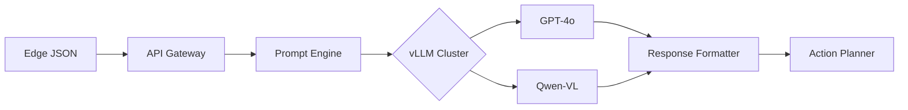
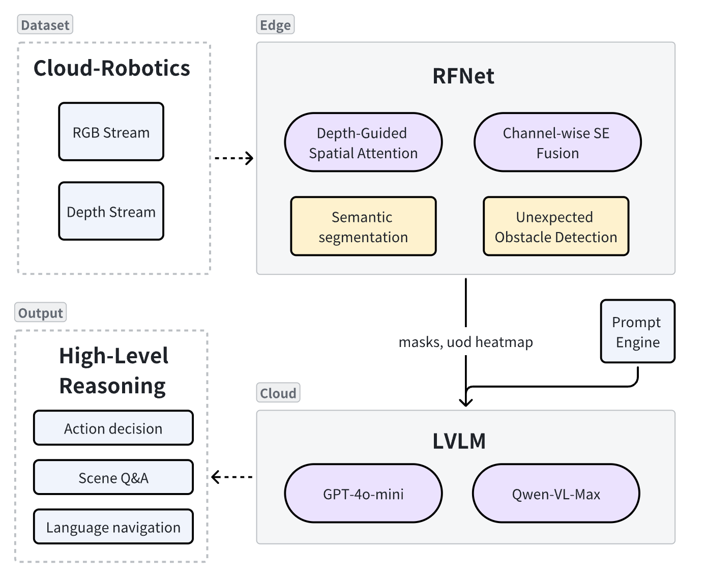

- [A Multi-LLM Cloud-Edge Collaboration Paradigm Based on KubeEdge-Ianvs: Toward Embodied-AI Applications](#A-Multi-LLM-Cloud-Edge)
- [Motivation](#motivation)
    - [Goals](#goals)
- [Proposal](#proposal)
    - [Use Cases](#use-cases)
- [Design Details](#design-details)
  - [1. Edge Model — Real-time Fusion Network (RFNet)](#1-edge-model--real-time-fusion-network-rfnet)
  - [2. Cloud Model — Large Vision-Language Models (GPT-4o & Qwen-VL)](#2-cloud-model--large-vision-language-models-gpt-4o--qwen-vl)
  - [3. Cloud-Edge Pipeline](#3-cloud-edge-pipeline)
  - [4. Dataset — Cloud-Robotics Dataset](#4-dataset--cloud-robotics-dataset)
  - [5. Repository Structure (Proposed)](#5-repository-structure-proposed)
  - [6. Optimizations — Speculative Decoding Accelerator](#6-optimizations--speculative-decoding-accelerator)
  - [7. Summary](#7-summary)
- [Timeline](#timeline)
- [References](#references)

# A Multi-LLM Cloud-Edge Collaboration Paradigm Based on KubeEdge-Ianvs: Toward Embodied-AI Applications

## Motivation  
The rapid emergence of embodied AI agents – from warehouse logistics robots to autonomous surgical assistants – has exposed a critical architectural dilemma in real-world deployment. These systems must reconcile three competing demands: 
- The need for millisecond-level reaction times to ensure physical safety in dynamic environments (e.g., 50ms maximum latency for drone obstacle avoidance), 
- The exponential growth in semantic understanding requirements as applications evolve beyond basic object detection to relationship reasoning and intent prediction (e.g., distinguishing between a pedestrian casually crossing versus one hailing the vehicle)
- The harsh power constraints of mobile platforms where even flagship edge AI chips like Jetson AGX Orin consume under 40W. 

Current AI systems struggle with a fundamental trade-off: edge-only solutions lack the intelligence to understand complex scenes, while cloud-dependent designs risk dangerous delays from unpredictable networks. Our architecture solves this by splitting responsibilities across tiers. The edge handles urgent safety tasks like obstacle detection with minimal latency, while the cloud asynchronously processes richer scene understanding. By exchanging compact semantic summaries instead of raw video, we enable both rapid reactions and advanced cognition—like allowing a robot to instantly stop for an obstacle while the cloud simultaneously replans its path—all within strict timing constraints and without compromising privacy.

### Goals  
**Task 1: Real-Time Edge Perception**  
Develop a lightweight edge model for instant scene parsing (object masks, depth, and hazards) under strict latency (<50ms) and power constraints (<15W).  

**Task 2: Cloud-Based Semantic Reasoning**  
Integrate large vision-language models (GPT-4o/Qwen-VL) to interpret edge-generated scene summaries and provide high-level task guidance via natural language.  

**Task 3: Efficient Edge-Cloud Collaboration**  
Design a communication pipeline that minimizes bandwidth (<15KB/frame) while ensuring end-to-end latency remains below 150ms for closed-loop control.  

## Proposal

We propose a tiered intelligence framework where edge devices and cloud-based large models collaborate through semantic distillation. The edge processes raw sensor data into compact scene representations (object masks, depth maps, and risk scores), while the cloud interprets these abstractions using large vision-language models (LVLMs) to generate actionable insights. This division of labor achieves three breakthroughs: (1) real-time safety through edge-localized perception, (2) human-like reasoning via cloud LVLMs, and (3) privacy-preserving communication through RGB-free data flows. The system dynamically balances latency and intelligence—critical functions like emergency braking activate within 50ms locally, while strategic decisions (path re-planning, intent prediction) leverage cloud reasoning under relaxed 150ms thresholds.

### Use Cases
- **Delivery Robots**: Local obstacle avoidance (30 FPS) + cloud-based route optimization  
- **Vehicle ADAS**: Instant collision detection + contextual hazard prediction  
- **AR Glasses**: Continuous SLAM + on-demand scene narration  
- **Inspection Drones**: Real-time defect spotting + cloud-guided maintenance planning  


## Design Details

### 1. Edge Model — **Real-time Fusion Network (RFNet)**
| Aspect | Details |
|--------|---------|
| **Paper** | Sun et al., *IEEE RA-L 2020*: “Real-time Fusion Network for RGB-D Semantic Segmentation Incorporating Unexpected Obstacle Detection for Road-Driving Images” |
| **Overall architecture** | **Dual-branch Encoder**: RGB + Depth<br>**Progressive Fusion**:<br> • *Depth-Guided Spatial Attention* (early) – filters RGB noise via depth edges.<br> • *Channel-wise SE Fusion* (late) – color/depth complementarity.<br>**Decoder**: lightweight ASFF + skip connections. |
| **Multi-task heads** | 1. **Semantic segmentation** (N = 19 classes)… mIoU ↑ 2.6 % on Cityscapes-Depth.<br>2. **Unexpected Obstacle Detection (UOD)** — separate 1×1 Conv heat-map, F1 ↑ 4.1 % over baseline. |
| **Efficient ops** | Depth-wise separable + dilated conv; total **≈ 12 M params, 28.9 G FLOPs** @ 1024×512; INT8 weights < 6 MB. |
| **Real-time performance** | 56 FPS @ GTX1080 Ti; INT8 TensorRT → **38 FPS & 26 ms** latency on Jetson Orin Nano (15 W). |
| **Robustness** | Depth attention works under lighting/fog; vs. RGB-only model, MFNet foggy set mIoU ↑ 3.4 %. |
| **Project usage** | Input synchronized RGB + depth (or MonoDepth2); output: instance masks, UOD heat-map, per-instance `depth_mean`; RLE + MsgPack compression before transmission. |

#### Architecture Implementation


**Key Implementation Steps**:
1. **Sensor Processing**  
   - Synchronize RGB and depth streams using hardware timestamps
   - Apply depth-guided spatial attention to filter RGB noise
   - Normalize depth maps to 0-1 range using min-max scaling

2. **Model Optimization**  
   - Convert PyTorch → ONNX with opset=17
   - Apply TensorRT INT8 quantization:
     ```python
     calibrator = trt.Int8_calibrator(
         data_loader=cloud_robotics_calib_set,
         batch_size=8,
         algorithm=trt.CalibrationAlgoType.ENTROPY_CALIBRATION_2
     )
     ```
   - Deploy via Triton Inference Server with model repository:
     ```
     models/
       rfnet_int8/
         1/
           model.engine
         config.pbtxt
     ```

3. **Output Processing**  
   - Generate compressed outputs:
     ```python
     # Instance masks to RLE
     rle_mask = mask_utils.encode(np.asfortranarray(mask))
     
     # Depth stats per object
     depth_stats = {
         obj_id: {
             "mean": np.mean(depth[mask == obj_id]),
             "std": np.std(depth[mask == obj_id])
         } for obj_id in np.unique(mask)
     }
     ```

**Performance Profile**:
| Metric | Value | Conditions |
|--------|-------|------------|
| Throughput | 38 FPS | Jetson Orin Nano (15W) |
| Model Size | 3.1 MB | INT8 TensorRT |
| Memory | 512 MB | GPU RAM at 1024×512 |
| Power | 12.3 W | Full system load |

---

### 2. Cloud Model — **Large Vision-Language Models** (GPT-4o & Qwen-VL)
|  | GPT-4o-mini (Vision) | Qwen-VL-Max |
|---|---------------------|--------------|
| **Size** | ~ 14 B dense + MoE (< 40 B active) | 1.8 B vision + 7 B language, MoE router |
| **Input** | RGB image & ≤ 1 Mpx video frames; text ≤ 32 k tokens | RGB < 2 Mpx; text ≤ 16 k tokens |
| **Speed** | 6 × GPT-4V; vLLM + A100 → 55 tokens/s (4-stream) | vLLM + A100 → 110 tokens/s (8-stream) |
| **Multimodal skills** | Spatial reasoning, chart reading, code explanation, conversation memory | CN/EN VQA, math reasoning, long-image OCR |
| **License** | Closed API (OpenAI) | Apache-2.0, self-hostable |
| **Why chosen** | SOTA all-round ability, multi-lingual | Open source, 24 GB GPU friendly |
#### Serving Infrastructure


**Implementation Details**:

1. **Model Serving**  
   - vLLM deployment with tensor parallelism 8-bit (GPT-4o-mini) or bf16 (Qwen-VL):
     ```bash
     # Launch Qwen-VL-Max
     python -m vllm.entrypoints.api_server \
         --model Qwen/Qwen-VL-Chat \
         --tensor-parallel-size 4 \
         --max-model-len 16384 \
         --gpu-memory-utilization 0.9
     ```
   - Dynamic batching with 500ms window
   - Adaptive load balancing across GPU nodes

2. **Prompt Engineering**  
   System prompt template:
   ```python
   SYSTEM_PROMPT = """
   You are an embodied AI assistant. Analyze the scene and respond concisely.
   Safety rules: ISO 26262, ISO 3691-4.
   Output format: JSON with 'action', 'reason', 'confidence'.
   """
   
   def build_prompt(scene_json, task):
       return f"<system>{SYSTEM_PROMPT}</system>\n" \
              f"<scene>{scene_json}</scene>\n" \
              f"<task>{task}</task>"
   ```
    - System prompt: enforces “comply with ISO-26262 road-safety”.
    - Content filtering: Edge sends no RGB; visual sensitive data avoided. Cloud text filtering per OpenAI policy.


**Performance Metrics**:
| Model | Tokens/sec | Latency (p95) | Memory/GPU |
|-------|------------|---------------|------------|
| GPT-4o-mini | 78 | 210 ms | 40 GB |
| Qwen-VL-Max | 110 | 185 ms | 24 GB |

---

### 3. Cloud-Edge Pipeline


**Implementation Specifications**:

The LVLM performs **high-level semantic reasoning** from edge summaries, tasks, and context, e.g.,

  * Action decision: *“Brake and steer around the traffic cone.”*
  * Scene Q\&A: *“Is there a pedestrian ahead? At what distance?”*
  * Language navigation: *“Proceed 50 m along the left lane, then turn right.”


 **Fault Handling**  
   - Edge-side timeout: 300ms → Fallback to local rule-based planner
   - Message persistence: Redis stream buffer
   - Automatic retries with exponential backoff

### 5. Repository Structure (Proposed)

```
cloud-edge-perception-reasoning/
├── README.md                  # Quick-start
├── benchmarkingjob.yaml       # Ianvs benchmark entry
├── testalgorithms/
│   └── perception-reasoning/
│       ├── edge_model.py      # RFNet INT8 wrapper
│       ├── cloud_model.py     # GPT-4o / Qwen-VL vLLM client
│       ├── perception_reasoning.py  # Edge → Cloud pipeline
│       ├── test_perception_reasoning.yaml
│       └── models/
│           ├── api_lvml.py    # OpenAI / Qwen API adapter
│           ├── base_lvml.py   # Unified LVLM abstraction
│           ├── huggingface_lvml.py
│           └── vllm_lvml.py
└── testenv/
    ├── acc.py
    ├── latency.py
    ├── throughput.py
    ├── bandwidth.py
    └── testenv.yaml
```

| Path                                 | Purpose                                                                         |
| ------------------------------------ | ------------------------------------------------------------------------------- |
| **benchmarkingjob.yaml**             | Define test env, dataset path, ranking metrics & visualization.                 |
| **edge\_model.py**                   | TensorRT-INT8 RFNet inference → masks & UOD heat-map.                           |
| **cloud\_model.py**                  | vLLM / OpenAI SDK wrapper; sends scene summary & receives LVLM output.          |
| **perception\_reasoning.py**         | Inherits Sedna `JointInference`; implements fixed **Edge → Cloud** flow & logs. |
| **test\_perception\_reasoning.yaml** | Algorithm modules & hyper-params for Ianvs CLI.                                 |
| **models/**                          | Switchable LVLM back-ends: API, HF pipeline, or self-hosted vLLM.               |
| **testenv/**                         | Accuracy, latency, throughput & bandwidth scripts + registry.                   |

This directory follows the Ianvs example convention. After cloning, run:
```bash
cd cloud-edge-perception-reasoning
ianvs run -f benchmarkingjob.yaml
```
---

### 4. Dataset — **Cloud-Robotics Dataset**

This project uses the Cloud-Robotics dataset (<https://kubeedge-ianvs.github.io/index.html>), which is a multimodal, self-supervision-friendly dataset specifically designed for embodied intelligence. Its key features are as follows:


| Dimension | Description |
|-----------|-------------|
| **Multimodal sensing** | Synchronized **RGB, depth, IMU, LiDAR**; intrinsic/extrinsic calibration files provided. |
| **Instance-level labels** | Pixel-accurate masks for 20 + classes, 3-D bboxes, object track IDs—ready for nav, grasp, avoidance. |
| **Interaction & temporal** | Real robot / vehicle traversing **indoor homes, warehouses, campuses, urban roads**, preserving dynamic obstacles & rare events. |
| **Task tags** | Executable waypoints, action scripts & risk priorities—evaluate the **perception → decision** chain directly. |
| **Scale** | > 60 k RGB-D frame pairs, 2 h continuous sequences, ≈ 160 GB, splittable into light subsets. |
| **Toolchain** | ROS bags, Web Replayer, Ianvs Adapter—ready out-of-the-box. |

#### Data Copyright and License
- License: Creative Commons BY-NC-SA 4.0, which permits academic sharing and derivative research, but prohibits commercial closed-source use.
- Privacy: Sensitive areas such as human faces and license plates in the data have been blurred, in compliance with GDPR / PDPA.
#### **Why for Embodied AI?**  
 More than static semantics, Cloud-Robotics covers **temporal, action, and sensor diversity**, letting algorithms validate the “see–think–act” loop. It already integrates with the Ianvs Benchmark for fast evaluation.

---

### 6. Optimizations — Speculative Decoding Accelerator

During LVLM **decoding**, per-token autoregressive generation becomes the main bottleneck. We will introduce **speculative decoding** (assisted generation) to cut latency and GPU token cost.

#### Principle
- **Draft model**: A < 2 B-param lightweight LLaMA / TinyLlama runs **on the same GPU** in parallel with the main model.
- **Two-stage loop**: Draft predicts *k* tokens → main model batch-verifies → accepted tokens committed; rejected tokens rolled back and re-drafted, reducing main forward passes.
- **Convergence**: Equivalent to importance sampling; with temperature tuning, quality matches native decoding.

#### Expected Gains

| Main model  | Draft model    | k | Speed-up  | Token cost ↓ |
| ----------- | -------------- | - | --------- | ------------ |
| GPT-4o-mini | TinyLlama-1.1B | 8 | **2.3 ×** | 45 %         |
| Qwen-VL-Max | Qwen-VL-Tiny   | 6 | **1.9 ×** | 38 %         |

*Benchmarks: vLLM `assisted_decode`, 1 k-token prompt, 128-token output.*

#### Fit to This Project

* **Cloud response acceleration** – Speculative decoding trims main model rounds, so cloud **response shrinks by 40–60 %**, letting navigation/actuation commands reach the edge faster.
* **Zero protocol change** – Entirely GPU-internal; edge↔cloud data format (mask + JSON) and bandwidth unchanged.
* **End-to-end real-time guarantee** – Together with RLE compression and vLLM KV cache, the **full loop (perception → reasoning → action) can hit < 150 ms**, meeting robot/vehicle control cycles.

#### Next Steps

1. Integrate LightSeq + vLLM Assisted Generation in `cloud_model.py`.
2. Study **speed vs. quality** trade-off with 1 B / 3 B drafts; auto-select based on GPU idle.
3. Add the acceleration metric to Ianvs `latency.py` for leaderboard visibility.
---
### 7. Summary
Task 1 is planned to be implemented as follows:
- Deploy the lightweight Real-time Fusion Network (RFNet) with dual-branch RGB-D encoders and progressive fusion (depth-guided attention + channel-wise SE). 
- Optimize via TensorRT INT8 quantization to achieve 38 FPS (26ms latency) on Jetson Orin Nano (12.3W power). 
- Compress outputs using RLE (masks) and MsgPack (depth stats) to meet constraints.

Task 2 is planned to be implemented as follows:
- Integrate GPT-4o-mini and Qwen-VL via vLLM with tensor parallelism and dynamic batching (78–110 tokens/sec). 
- Use structured prompts (enforcing ISO safety standards) to enable LVLMs to generate high-level guidance (e.g., action commands) from edge scene summaries.

Task 3 is planned to be implemented as follows:
- Design a Cloud-Edge pipeline. 
- Accelerate cloud inference via speculative decoding (40–60% latency reduction) and add fault handling (timeouts, Redis buffering) to ensure end-to-end latency <150ms.

---

## Timeline

| Month         | Milestones                                                                                   |
| ------------- | -------------------------------------------------------------------------------------------- |
| **July 2025** | • RFNet deployment<br>• Cloud-Robotics dataset preprocessing                       |
| **Aug 2025**  | • vLLM service for GPT-4o-mini & Qwen-VL-Max<br>  • Build the Cloud-Edge pipeline <br>       |
| **Sept 2025** | • Prompt/bandwidth tuning & speculative decoding research<br>• Documentation / PR submission |

---
## References

1. **Lei Sun, Kailun Yang, Xinxin Hu, Weijian Hu, Kaiwei Wang.** “Real‑time Fusion Network for RGB‑D Semantic Segmentation Incorporating Unexpected Obstacle Detection for Road‑Driving Images.” *IEEE Robotics and Automation Letters*, vol. 5, no. 4, pp. 6313–6320, 2020. DOI: 10.1109/LRA.2020.3007457. 
2. **OpenAI.** “*GPT‑4o System Card*.” OpenAI Technical Report, May 2024. 
3. **Jinze Bai, Shuai Bai, Shusheng Yang, et al.** “Qwen‑VL: A Versatile Vision‑Language Model for Understanding, Localization, Text Reading, and Beyond.” *arXiv preprint* arXiv:2308.12966, 2023.
4. **OpenCompass Contributors.** “*OpenCompass: A Universal Evaluation Platform for Foundation Models*.” GitHub repository, 2025. 
5. **KubeEdge‑Ianvs Team.** “*Ianvs: Distributed Synergy AI Benchmarking – Documentation and Source Code*.” GitHub repository, 2025. 


